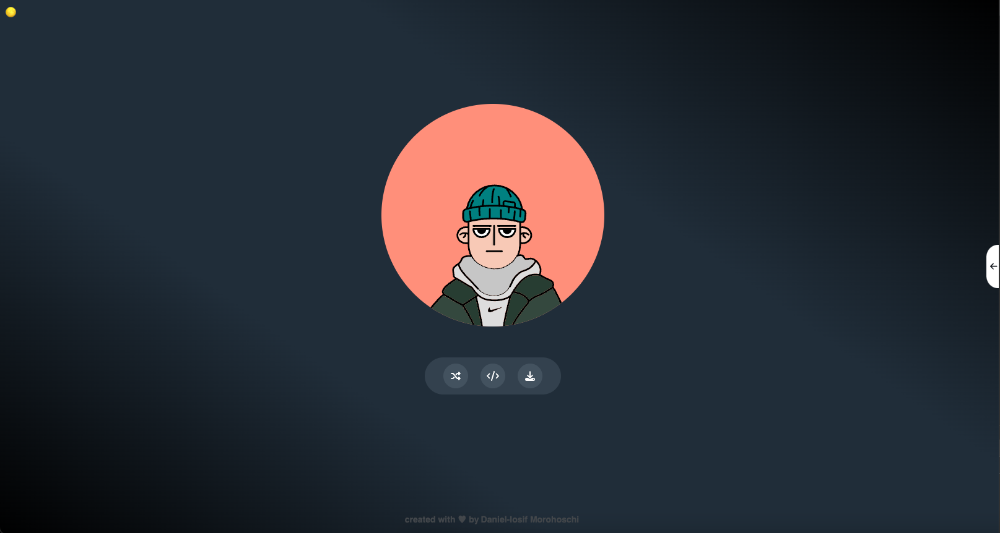
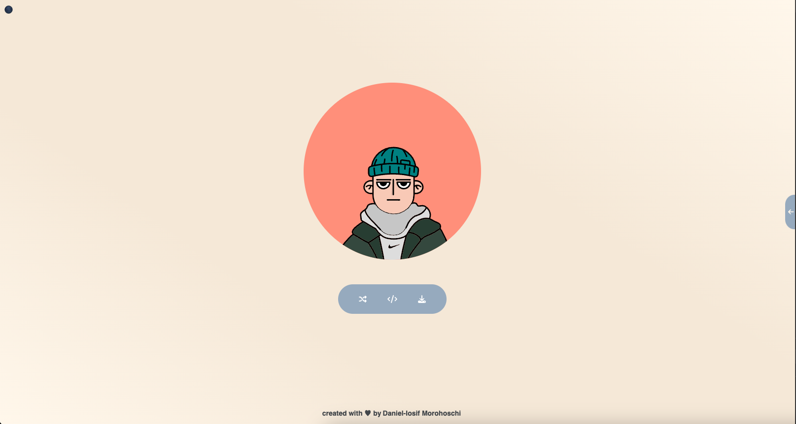
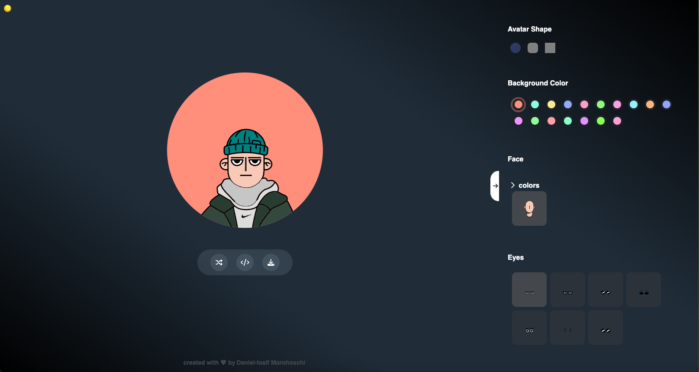
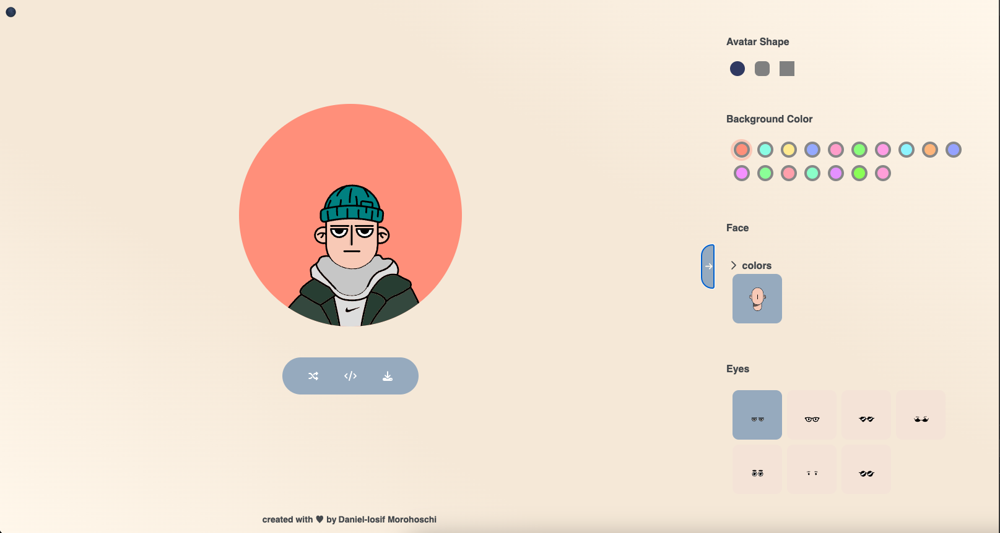
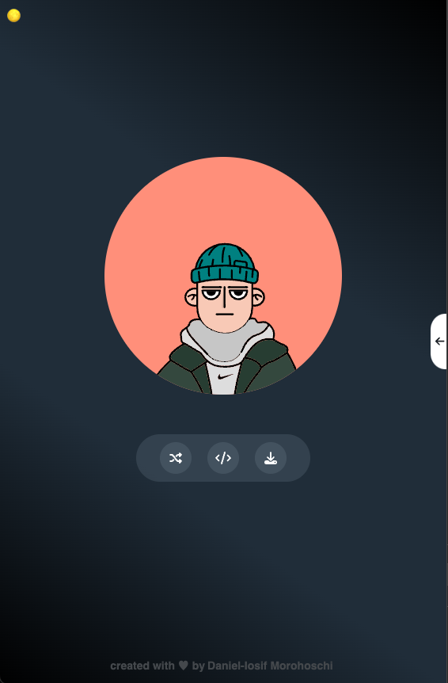
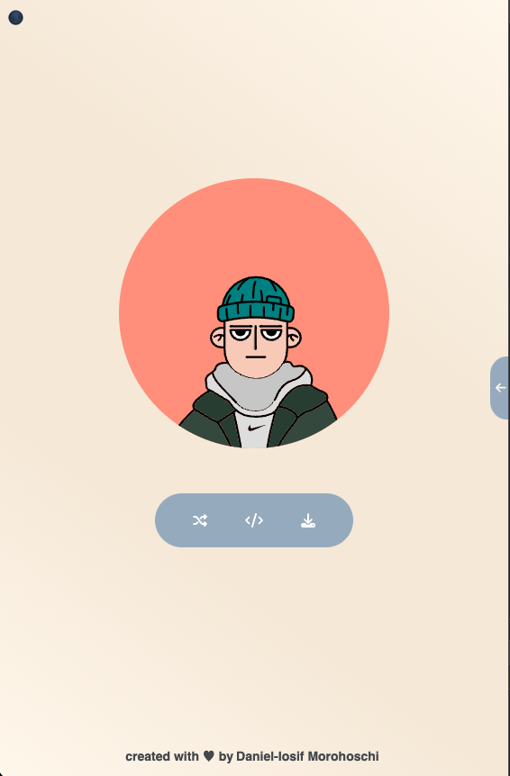
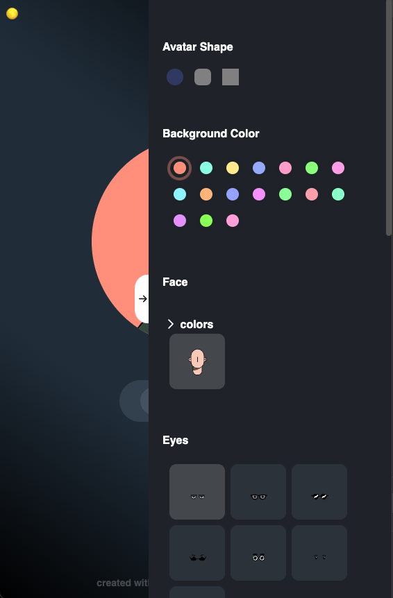
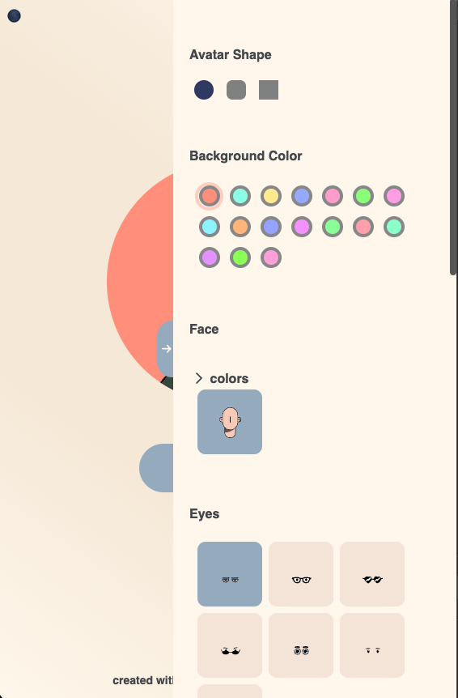

# Color Avatar Web Page

This web page allows you to create personalized avatars using SVGs designed by [Francisco Antonio Vázquez Olivares](https://www.figma.com/@pacovqzz).

| Dark Mode                                                                    | Light Mode                                                                     |
| ---------------------------------------------------------------------------- | ------------------------------------------------------------------------------ |
|            |            |
|  |  |
|              |              |
|    |    |

## Features

- **Customizable Avatars:** You can create avatars using a variety of SVG shapes and elements designed by [Francisco Antonio Vázquez Olivares](https://www.figma.com/@pacovqzz).

- **Dark Mode and Light Mode:** The web page supports both dark and light mode to match your preference.

- **Shape Options:** Choose from different shapes for your avatars, including rounded, square, and square with rounded corners.

- **Responsive Design:** The page is fully responsive and can be accessed from various devices and screen sizes.

## Technology Stack

- Built with **React:** The web page is developed using the React JavaScript library, providing a dynamic and interactive user experience.

- **Styled Components:** CSS-in-JS is achieved using Styled Components, allowing for easy styling and theming of the components.

- Written in **TypeScript:** The codebase is written in TypeScript, ensuring a strongly typed and maintainable application.

## Getting Started

1. Visit the web page at [https://morohoschidanieli.github.io/create-avatar/](https://morohoschidanieli.github.io/create-avatar/).

2. Explore the available options for shape, mode, and customization.

3. Click the "Random" button to create your personalized avatar.

## Credits

- The SVG elements used for avatar creation were designed by [Francisco Antonio Vázquez Olivares](https://www.figma.com/@pacovqzz).

## Feedback and Support

If you encounter any issues or have suggestions for improvement, please [submit an issue](https://github.com/morohoschidanieli/create-avatar/issues?q=is%3Aissue+is%3Aopen+sort%3Aupdated-desc).

## License

This project is licensed under the [MIT License](LICENSE). See the [LICENSE](LICENSE) file for details.
